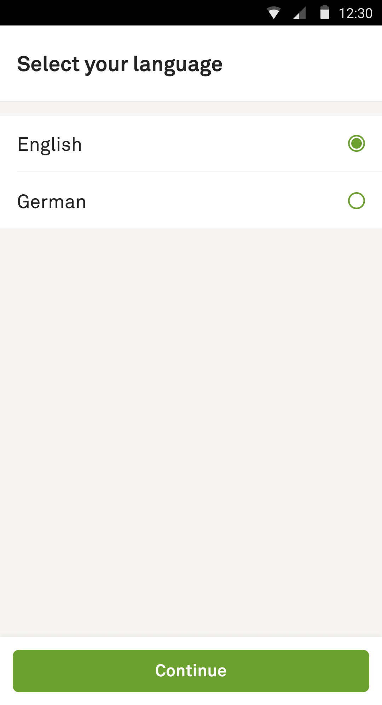

# Language selection

This is a screen that allows users to select language for the app. After selecting the language we want to fetch new app config for it and only then close the screen. In case config fetch fails we want to reset the language to the original one.

- [State](../../#what-is-a-state): [LanguageSelectionState.swift](LanguageSelectionState.swift)
- [Feedbacks](../../#how-do-i-use-states): [LanguageSelectionViewController.swift](LanguageSelectionViewController.swift)

| Language selection |
| --- |
|  |
