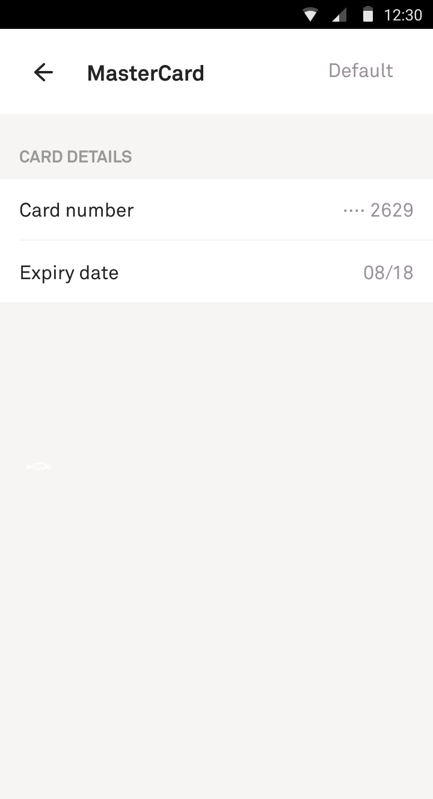
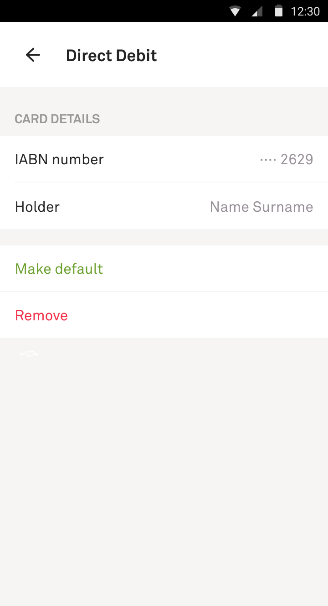
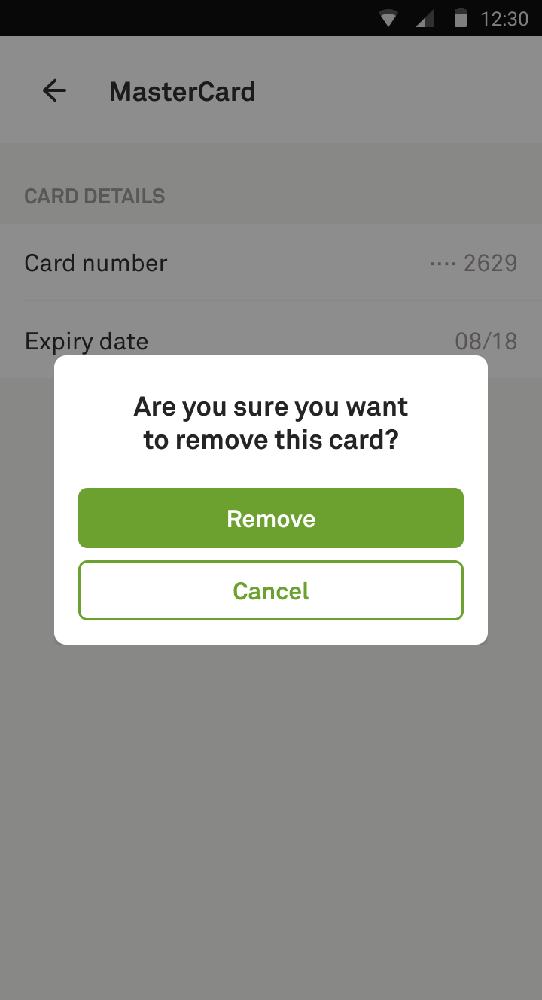

# Payment method details

This is a screen that displays information of a single payment method. Payment method can only be made the default payment method or removed if it's not the default payment method. Before removing we ask for users confirmation.

- [State](../../#what-is-a-state): [PaymentMethodDetailsState.swift](PaymentMethodDetails.swift)
- [Feedbacks](../../#how-do-i-use-states): [PaymentMethodDetailsViewController.swift](PaymentMethodDetailsViewController.swift)

| Default | Not default | Remove confirmation |
| --- | --- | --- |
|  |  | 
