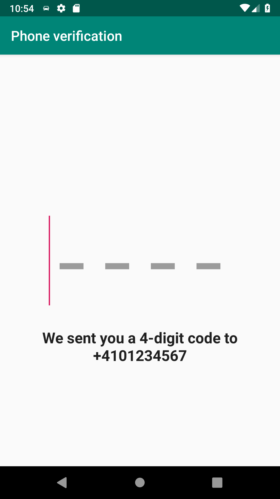

# Phone verification

This is the second screen in a phone verification flow, where the user needs to enter a 4-digit code received by SMS to verify their phone number.
The code can be entered manually or extracted directly from the SMS, and the user can request for the SMS to be resent.

- [State](/README.md#what-is-a-state): [PhoneVerificationState.kt](phoneverification/src/main/java/com/trafi/phoneverification/PhoneVerificationState.kt)
- [Machine](/README.md#how-do-i-use-states): [PhoneVerificationFragment.kt](phoneverification/src/main/java/com/trafi/phoneverification/PhoneVerificationFragment.kt)
- Tests: [PhoneVerificationStateSpec.kt](phoneverification/src/test/java/com/trafi/phoneverification/PhoneVerificationStateSpec.kt)

| Phone verification |
| --- |
|  |
